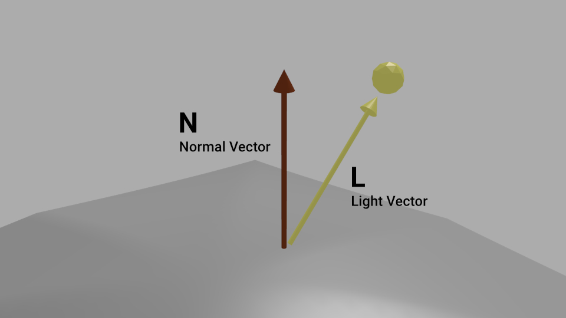
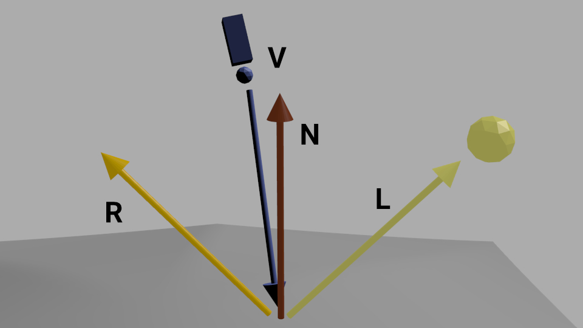
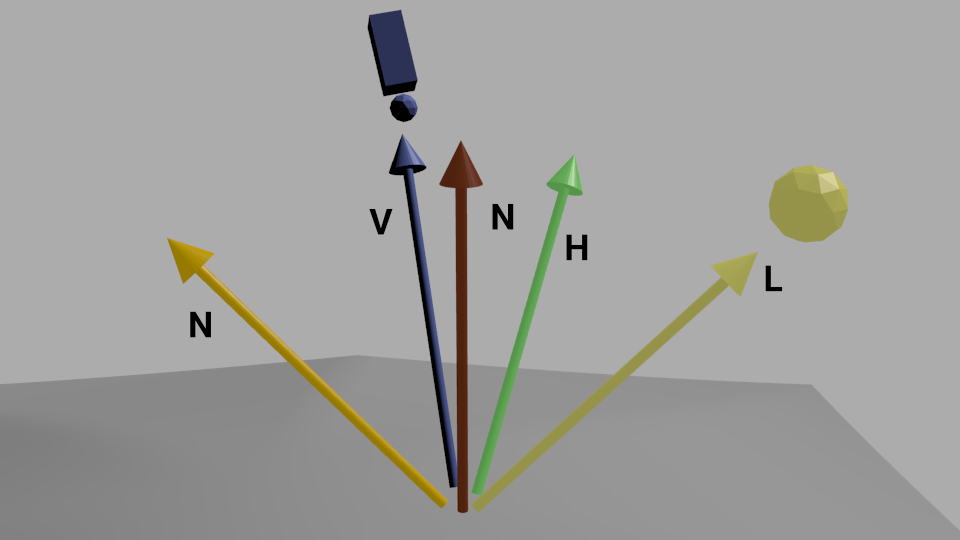

# 00 lighting

I implemented Diffuse Reflection/Specular Highlights/Specular Highlights at Silhouettes following [GLSL Programming/Unity
](https://en.wikibooks.org/wiki/GLSL_Programming/Unity) tutorial.

## Diffuse Reflection 

: Incoming Light

: Diffuse reflection

Tutorial: [GLSL_Programming/Unity/Diffuse_Reflection](https://en.wikibooks.org/wiki/GLSL_Programming/Unity/Diffuse_Reflection)

## Specular Hightlights

I follow [https://en.wikibooks.org/wiki/GLSL_Programming/Unity/Specular_Highlights](https://en.wikibooks.org/wiki/GLSL_Programming/Unity/Specular_Highlights) tutorial, and use **Phong reflection model**.

the normalized reflected direction **R** is defined by:

:  shininess of the material

 The specular term of the Phong reflection model is then:

 

Tutorial: [GLSL Programming/Unity/Specular Highlights](https://en.wikibooks.org/wiki/GLSL_Programming/Unity/Specular_Highlights)

## Specular Hightlights at Silhouettes

Schlick's approximation is:

Replacing  by Schlick's approximation for the Fresnel factor with 

Tutorial: [GLSL Programming/Unity/Specular Highlights at Silhouettes](https://en.wikibooks.org/wiki/GLSL_Programming/Unity/Specular_Highlights_at_Silhouettes)

References

- Schlick, C. (1994). "[An Inexpensive BRDF Model for Physically-based Rendering](http://www.cs.virginia.edu/~jdl/bib/appearance/analytic%20models/schlick94b.pdf)"